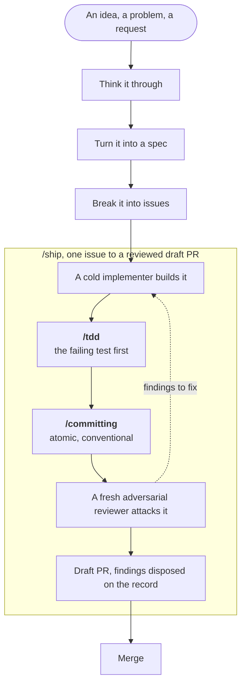

# agent-skills

A curated collection of Claude Code workflows, packaged as plugins.

More than a toolbox: this repo is the documented specification of how I
engineer, and the skills are how that practice compiles today. See
[`docs/PRD.md`](docs/PRD.md#mission) for the mission, and
[`docs/PRACTICE.md`](docs/PRACTICE.md) for the practice itself, mapped step by
step.

Each workflow is a self-contained plugin directory bundling its own skills
**and** its own agents, so the pieces ship and version together and cannot drift
apart.

## The trunk

Idea to merged code, and where these plugins sit on it.



The shaded box is what this collection covers today. The steps above it are the
next thing to be brought in; [`docs/PRACTICE.md`](docs/PRACTICE.md) tracks which
step is served by what, and which are still done by hand.

## Workflows

Plugins that coordinate agents.

| Plugin | Entry points | What it does |
| --- | --- | --- |
| [`ship`](plugins/ship/) | `/ship`, `/grill-pr` | Drives one issue to a reviewed draft PR: a cold implementer builds it, an adversarial reviewer attacks it, GitHub carries the handoff |

## Skills

Single-purpose plugins, usable on their own and depended on by the workflows.

| Plugin | Entry points | What it does |
| --- | --- | --- |
| [`tdd`](plugins/tdd/) | `/tdd` | Test-first at real seams: observe the failure, make it pass, then clean up. Refuses to write a test that cannot fail |
| [`committing`](plugins/committing/) | `/committing` | Atomic commits with Conventional Commit messages: one commit does one thing, and the body says why rather than what |

## Install

**For authoring** (loads in place, `SKILL.md` edits apply live):

```bash
ln -s /path/to/agent-skills/plugins/<plugin> ~/.claude/skills/<plugin>
```

On Windows use a junction (no elevation, no Developer Mode). Git Bash's `ln -s`
silently copies instead, which looks identical and never picks up an edit:

```powershell
cmd /c mklink /J "$HOME\.claude\skills\<plugin>" "D:\path\to\agent-skills\plugins\<plugin>"
```

**For use elsewhere**, via the marketplace:

```
/plugin marketplace add jeremiah-wa/agent-skills
/plugin install <plugin>@agent-skills
```

## Requirements

`ship` needs the `gh` CLI authenticated against a GitHub remote. It preflights and
refuses rather than degrading to a local-only mode.

## Validate

```bash
claude plugin validate . --strict
claude plugin validate ./plugins/<plugin> --strict
```

## Contributing

[`AGENTS.md`](AGENTS.md) is the operating manual: invariants, house rules, which
doc owns what, and when each needs updating.
