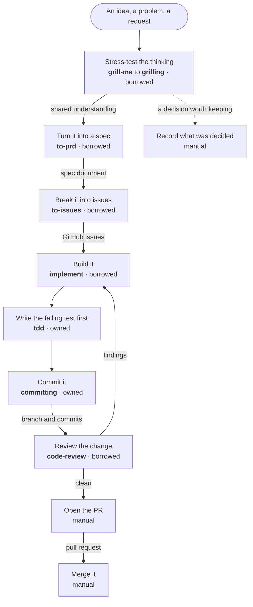
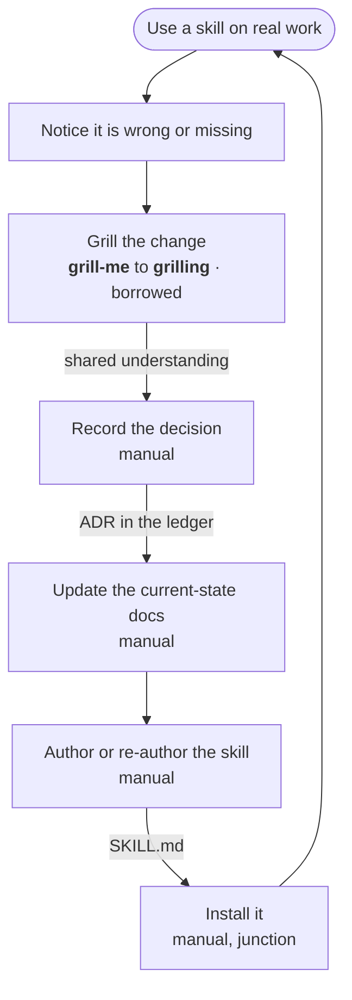
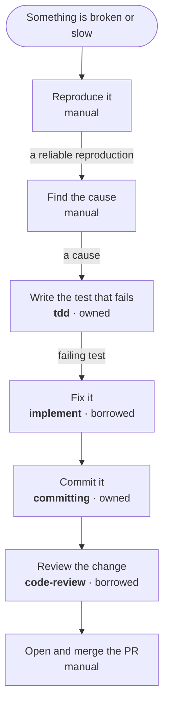
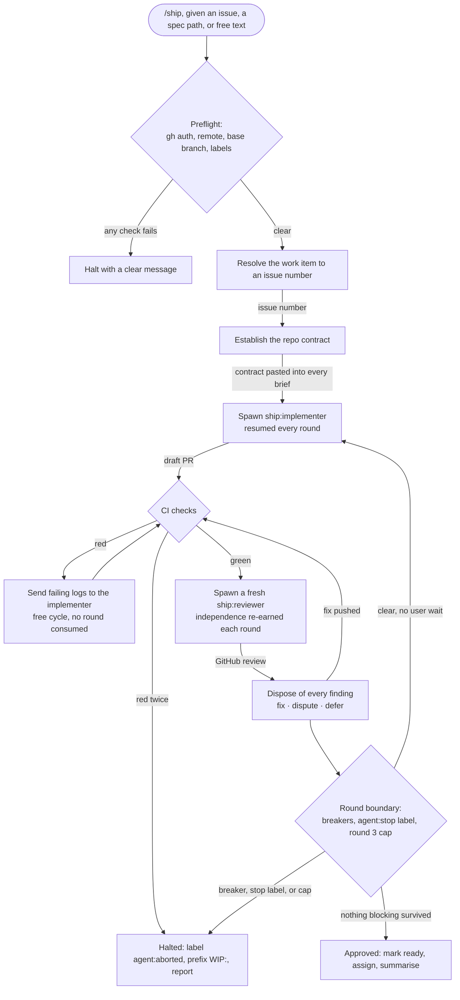

# agent-skills, Practice

How I actually work, drawn as-is, with the skill serving each step and whether
that skill is in this repo.

This is an instrument, not a portrait. Its job is to make the gaps visible: the
steps still done by hand, the steps leaning on somebody else's skill, and the
steps that work on one laptop and nowhere else. A step that looks covered on a
shelf inventory can be wide open here, and that is the point.

[`ARCHITECTURE.md`](ARCHITECTURE.md) says how this repo is built.
[`specs/`](specs/) says what each piece must do, one file per plugin. This file
says how I work, which is the thing the rest exists to serve
([`PRD.md`](PRD.md#mission)).

## How to read these

Every node is a **step of work**, not a skill. That is deliberate: if nodes were
skills, the steps with no skill would be invisible, and those are the findings.
The skill and its status ride in the label. Edges carry the **artifact** handed
over, where one exists. A seam with no named artifact is its own kind of smell,
because it means the handover lives in my head.

| Status | Meaning | The fix |
|---|---|---|
| **owned** | The skill is a plugin in this repo. | Nothing. |
| **borrowed** | A third-party skill installed on this machine, doing real work, not mine. | Re-author it here from a blank page ([ADR-0005](decisions/0005-author-from-a-blank-page.md)). |
| **local** | Authored by me, living in `~/.claude/skills/` on one machine. Not in any marketplace, not under version control. | Move it into this repo. Cheapest fix on the board. |
| **manual** | No skill runs this step. | Write one, or decide it should stay manual. |

Only **owned** is portable. `borrowed`, `local`, and `manual` all mean the same
thing to anyone else installing this collection: the step does not happen. They
differ only in what the fix costs. A `borrowed` skill named in a workflow
resolves at runtime against whatever happens to carry that name on the machine,
which is the silent failure
[ADR-0006](decisions/0006-declare-invoked-skills-as-dependencies.md) exists to
stop.

**A skill that exists but has never been invoked is drawn as `manual`**, with the
unused skill named underneath. As-is means what I do, not what is installed.

## Idea to merged code

The trunk. Everything else is a detour off it.

**What this says.** Nine steps, of which **two are owned**: writing the failing
test and committing. Four still run on mattpocock's collection, and three are
done by hand.

Those two moved in the same session that produced this file. Before it, the
count was zero: `tdd` was borrowed and `committing` sat in a directory on one
computer. That is the map doing its job, and it is also the only evidence so far
that it gets maintained.

**`ship` is not on this diagram.** It is owned, it is specified to reconstruction
depth in [`specs/ship.md`](specs/ship.md), and it covers the build, review, and
PR steps in one loop. It has also **never been invoked**, here or anywhere.
Drawing it on the trunk would claim a way of working that is not yet the way of
working. This is [`PRD.md`](PRD.md#open-questions) open question 1 arriving from
the other direction: the evidence says the ceremonious workflow was built and
the light one gets reached for every time. Its loop is drawn below, under
[Inside `ship`](#inside-ship).

**The three manual steps are the real finding.** Opening and landing a PR is
probably fine by hand. Recording a decision is not: this repo runs an
append-only ledger, `PRD.md` names a docs skill as first-pass work, and the step
that feeds it has nothing behind it.

## Growing the practice

The meta-loop. This repo is the thing it operates on, and the session that
produced this file is one turn of it.

**What this says.** Grilling is the only automated step in the loop that grows
every other skill, and it is borrowed. Everything downstream of the decision is
hand work: writing the ADR, propagating it into `ARCHITECTURE.md`, `specs/`,
`GLOSSARY.md`, and this file, then authoring the skill to the house standard.

That is the highest-leverage gap on any of these three diagrams, because this
loop is the one that closes the others. Two skills are already named for it in
[`PRD.md`](PRD.md#first-pass): a docs skill owning the ledger and the
current-state docs, and the skill-writing standard from
[ADR-0009](decisions/0009-own-the-skill-writing-standard.md).

`writing-great-skills` is installed and has been invoked once. `grill-with-docs`
is installed, would compose grilling with the docs step, and has never run.

## Bug to fix

A short path that skips spec and issues entirely, which is why it is worth
drawing separately rather than treating as a thin trunk.

**What this says.** The front half is entirely manual. `diagnosing-bugs` is
installed and covers exactly the diagnose step, and it has never been invoked
across 127 transcripts, so it is drawn as manual. That is either a skill worth
re-authoring and adopting properly, or a skill worth deleting, and the map
cannot tell you which. It can only tell you the step is running on nothing.

The back half is the trunk's back half, node for node. That is a useful
confirmation rather than a redundancy: `tdd` and `committing` becoming owned
improved both paths at once, and whatever fixes `code-review` will do the same.

## Inside `ship`

Everything above stops at the boundary of a skill, because the gaps live at the
seams between skills and never inside one. `ship` is the exception worth opening
up, since it is the only owned workflow with real control flow of its own.

> **Derived from [`specs/ship.md`](specs/ship.md).** That file is canonical for
> `ship`'s contract. If this diagram and that spec disagree, the spec wins.

Both agents are cold. They share no conversation with the orchestrator or with
each other, and GitHub is the only handoff medium. The full contract, including
the five circuit breakers and the blocking-versus-advisory rule, is in
[`specs/ship.md`](specs/ship.md).

## Evidence

Counted across 127 transcripts in `~/.claude/projects/`, by `Skill` tool calls
and slash invocations combined.

| Skill | Invocations | Status |
|---|---|---|
| `grill-me` | 13 | borrowed |
| `grilling` | 12 | borrowed |
| `implement` | 8 | borrowed |
| `to-issues` | 3 | borrowed |
| `code-review` | 3 | borrowed |
| `to-prd` | 2 | borrowed |
| `committing` | 2 | owned |
| `tdd` | 1 | owned |
| `handoff` | 1 | borrowed |
| `writing-great-skills` | 1 | borrowed |

Never invoked: `to-spec`, `to-tickets`, `triage`, `prototype`,
`diagnosing-bugs`, `domain-modeling`, `research`, `wayfinder`,
`grill-with-docs`, and `ship`.

Two things fall out of that list. Grilling is used more than everything else
combined, which is why it heads the first pass in [`PRD.md`](PRD.md#first-pass).
And ten installed skills have never run, which is the evidence behind
[ADR-0004](decisions/0004-own-the-skills-we-use.md) and the out-of-scope rule in
[`PRD.md`](PRD.md#out-of-scope).

## What the map says today

Ranked by leverage, not by effort.

1. **The practice-growing loop is manual from the decision onward.** It is the
   loop that closes every other gap, so it compounds. A docs skill and the
   skill-writing standard are both already named in the first pass.
2. **`grill-me` and `grilling` are borrowed**, and they are used more than
   everything else combined. The most-used step in the practice is the one least
   owned, which is why they head the first pass in
   [`PRD.md`](PRD.md#first-pass).
3. **`implement` is borrowed and carries the whole build step**, on both the
   trunk and the bug path. It is also entangled with `ship`, so re-authoring it
   means answering open question 1 first rather than after.
4. **`ship` is owned, specified, and unexercised.** Either it earns a place on
   the trunk or `implement` does. Deciding that is
   [`PRD.md`](PRD.md#open-questions) open question 1, and the map has now put
   evidence behind it.
5. **Diagnosis and reproduction are manual**, with an installed skill covering
   the step that has never been used. Adopt it properly or drop it.

## Keeping this true

This file is illustrative, not normative. It describes the practice; it does not
specify any component, and nothing is generated from it. That means it can go
stale without anything catching it, so the rule is simple: **a change that moves
a skill between statuses updates this file in the same commit.** Authoring a
skill here, moving a local one in, or retiring a borrowed one all qualify.

The invocation counts are a snapshot and are expected to drift. Re-count them
when a claim in this file starts to feel wrong, not on a schedule.
